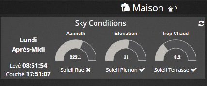
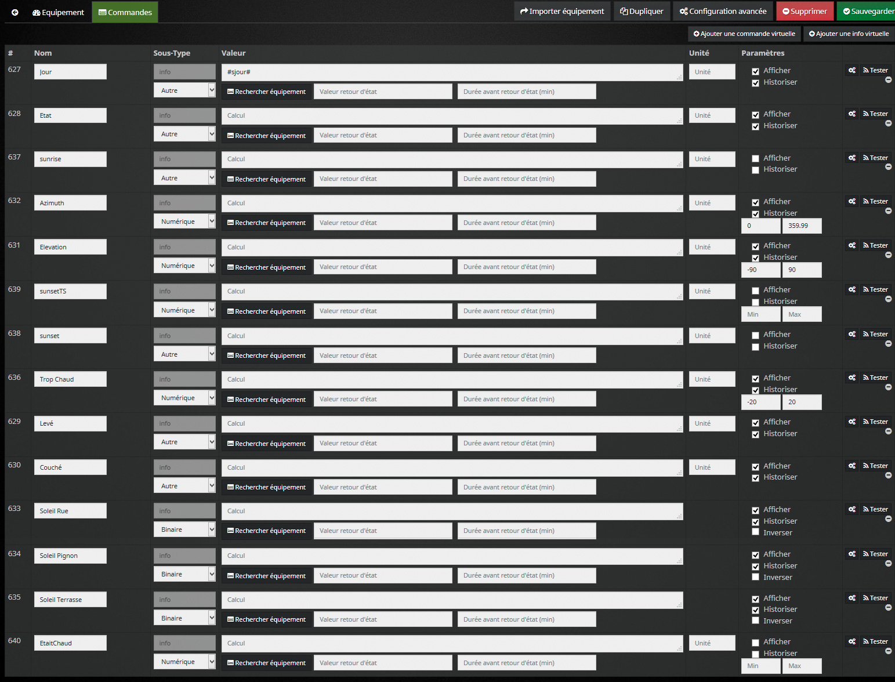
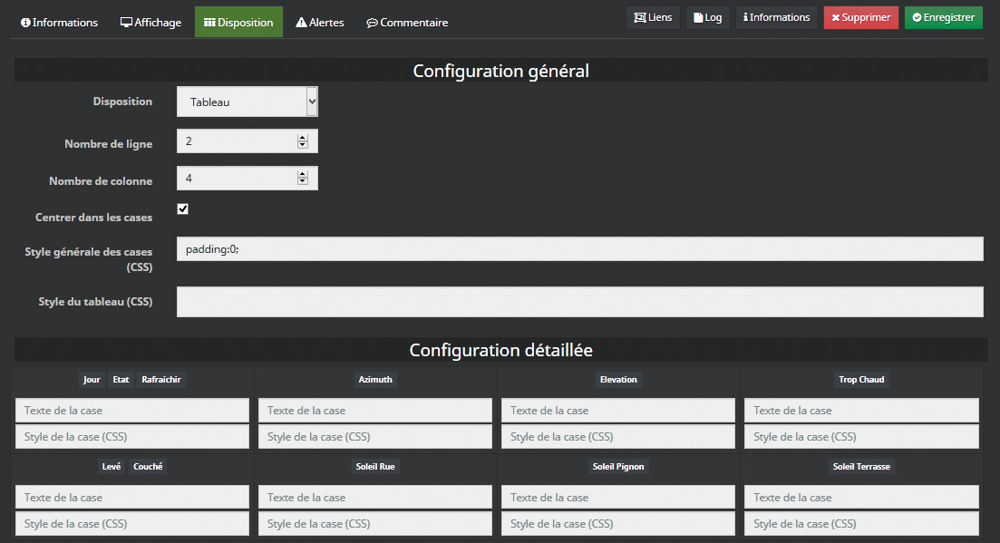
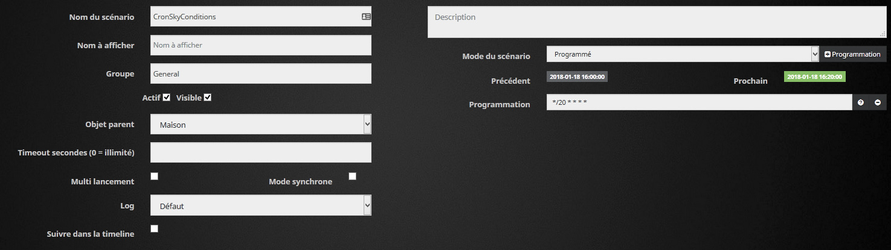

# php-sunPos - Jeedom

## Utilisation avec Jeedom


Voici un exemple d'utilisation de php-sunPos avec Jeedom, et une fois n'est pas coutume, en Français !

L'objectif consiste à récupérer toutes les valeurs journalières utiles avec seulement php-sunPos, donc en local sur votre box Jeedom, sans aucun plugin et sans internet, afin de pouvoir ensuite utiliser ces données (levé du soleil, azimuth, midi ou soir etc) dans des scénarios Jeedom.

Et c'est plutôt simple, puisque cela va consister à:

- Télécharger php-sunPos sur votre Jeedom.
- Créer un Virtuel avec toutes les infos virtuelles nécessaires.
- Créer un scénario avec un code php pour renseigner régulièrement les infos du Virtuel.

Il vous faudra pour çà deux plugins, gratuits:

- Le plugin Outils de développement
- Le plugin Virtuel

Voici le Virtuel sur le Dashboard:

<p align="center"></p>

> Vous pouvez bien sûr modifier ces infos comme bon vous semble, dans le
> Virtuel et dans le script, pour l'adapter à vos besoins.

## Télécharger php-sunPos sur votre Jeedom

- Récupérez le fichier phpSunPos.php
- Sur votre Jeedom, avec le plugin Outils de développement, créez un dossier kiboost et un sous dossier SunPos à la racine, et mettez le phpSunPos.php  dedans.

> Vous pouvez mettre le fichier où bon vous semble, il faudra simplement
> changer la première ligne du code du scénario un peu plus bas. Dans
> cet exemple, son chemin sera donc html/kiboost/SunPos/phpSunPos.php


## Création du Virtuel

- Rien de compliqué ici, Plugins/Programmation/Virtuel, puis créez un Virtuel en cochant *Activer* et *Visible*. Ici il aura pour nom Sky Conditions et pour parent Maison.

Créez ensuite autant d'infos virtuelles que nécessaire. Seule l'info jour doit avoir la valeur #sjour#, les autres seront renseignées par le code du scénario.

> Encore une fois, vous pouvez mettre et nommer les infos virtuelles comme vous voulez, et adapter le code plus bas pour correspondre.
>
> Par exemple, j'utilise les infos TropChaud et EtaitChaud pour contrôler la fermeture automatique des volets en été quand il fait très chaud dehors. A chacun d'adapter comme il le souhaite. De même, les infos Soleil Rue, Pignon et Terrasse me servent à savoir si le soleil tape directement sur les fenêtres correspondantes, en fonction de leur orientation, gérée dans le code plus bas. Pour celà il faut un module de température extérieure, que je récupère ici avec #[Jardin][Net.Exterieur][Température]#

<p align="center"></p>

Vous pouvez aussi adapter l'affichage du Virtuel sur le Dashboard:

<p align="center"></p>


## Création du scénario

Créez ensuite un scénario (*Actif* bien sûr) programmé. Personnellement, le mien s’exécute toutes les 20mins. Donc programmation */20 * * * *

Il s’exécute en moins d'une d'1sec et est entièrement local, sans nécessiter de connexion internet.

<p align="center"></p>

Ensuite dans le scénario, nous allons simplement créer un bloc *Code* avec le code suivant dedans.
Pour info, on peux aussi le faire avec un Plugin/Script et auto-actualisation. Mais personnellement, mon scénario possède d'autres blocs pour vérifier certaines choses ensuite dans certaines conditions. A vous d'adapter.

Modifiez le code suivant l'emplacement du script phpSunPos.php , le parent/nom de votre virtuel, et adaptez le à votre besoin.

Il faut aussi impérativement modifier les variables $lat et $long par les vôtres. Un petit tour sur Google Map, un clic sur votre maison, et elles s'affichent en bas.


```php
require_once dirname(__FILE__) . '/../../kiboost/SunPos/phpSunPos.php';

//infos:
$lat = 37.264910;
$long = -115.797592;
$timezone = 'Europe/Paris';

//API sun data:
$_SunPos = new sunPos($lat, $long, $timezone);
//$transit = $_SunPos->transit;
$SunEl = $_SunPos->elevation;
$SunAz = $_SunPos->azimuth;
cmd::byString("#[Maison][Sky Conditions][Elevation]#")->event($SunEl);
cmd::byString("#[Maison][Sky Conditions][Azimuth]#")->event($SunAz);

//both value for readable sunrise and scenario check
$sunrise = $_SunPos->sunrise;
cmd::byString("#[Maison][Sky Conditions][Levé]#")->event($sunrise);
$var = explode(':', $_SunPos->sunrise);
cmd::byString("#[Maison][Sky Conditions][sunrise]#")->event($var[0].$var[1]);

//both value for readable sunset and scenario check
$sunset = $_SunPos->sunset;
cmd::byString("#[Maison][Sky Conditions][Couché]#")->event($sunset);
$var = explode(':', $sunset);
cmd::byString("#[Maison][Sky Conditions][sunset]#")->event($var[0].$var[1]);

//also need sunset timestamp for some scenarios
$date = date('d/m/Y ').$sunset;
$date = DateTime::createFromFormat('d/m/Y H:i:s', $date);
$sunsetTS = $date->format('U');
cmd::byString("#[Maison][Sky Conditions][sunsetTS]#")->event($sunsetTS);

//set Etat:
$isDay = $_SunPos->isDay;
$isMorning = $_SunPos->isMorning;
$isNoon = $_SunPos->isNoon;
$isAfternoon = $_SunPos->isAfternoon;
$isEvening = $_SunPos->isEvening;

if ($isDay == 0) cmd::byString("#[Maison][Sky Conditions][Etat]#")->event('Nuit');
else
{
  if ($isMorning == 1) cmd::byString("#[Maison][Sky Conditions][Etat]#")->event('Matin');
  if ($isNoon == 1) cmd::byString("#[Maison][Sky Conditions][Etat]#")->event('Midi');
  if ($isAfternoon == 1) cmd::byString("#[Maison][Sky Conditions][Etat]#")->event('Après-Midi');
  if ($isEvening == 1) cmd::byString("#[Maison][Sky Conditions][Etat]#")->event('Soir');
}
```


Voici la partie, que vous devrez forcément adapter, qui récupère la température extèrieure et renseigne si telle ou telle façade est au soleil. A ajouter si nécessaire à la fin du script:


```php
//lighting:
$facRue = array(30, 210);
$isRueSun = 0;
if ($isDay==1) if ($_SunPos->isSunny($facRue[0], $facRue[1])) $isRueSun = 1;
cmd::byString("#[Maison][Sky Conditions][Soleil Rue]#")->event($isRueSun);

$facPignon = array(120, 300);
$isPignonSun = 0;
if ($isDay==1) if ($_SunPos->isSunny($facPignon[0], $facPignon[1])) $isPignonSun = 1;
cmd::byString("#[Maison][Sky Conditions][Soleil Pignon]#")->event($isPignonSun);

$facTer = array(210, 30);
$isTerSun = 0;
if ($isDay==1) if ($_SunPos->isSunny($facTer[0], $facTer[1])) $isTerSun = 1;
cmd::byString("#[Maison][Sky Conditions][Soleil Terrasse]#")->event($isTerSun);

/*
Get isHot value:
Ref:
    http://fooplot.com
    http://www.analyzemath.com/parabola/three_points_para_calc.html
    el:10 -> 18
    el:30 -> 21
    el:60 -> 22.5
*/
if ($isDay==0)
{
    cmd::byString("#[Maison][Sky Conditions][EtaitChaud]#")->event(-20);
    cmd::byString("#[Maison][Sky Conditions][Trop Chaud]#")->event(-20);
}
else
{
    $wasHot = cmd::byString("#[Maison][Sky Conditions][Trop Chaud]#")->execCmd();
    cmd::byString("#[Maison][Sky Conditions][EtaitChaud]#")->event($wasHot);

    $TempExt = cmd::byString("#[Jardin][Net.Exterieur][Température]#")->execCmd();
    $hotThld = (0.0006667 * -1) * pow($SunEl, 2) + 0.1267 * $SunEl + 20;
    $isHot = round($TempExt - $hotThld, 2);
    cmd::byString("#[Maison][Sky Conditions][Trop Chaud]#")->event($isHot);
}
```

## Et maintenant ?

- Exécutez une fois le scénario manuellement pour renseigner les infos du Virtuel une première fois.

Vous devriez avoir votre Virtuel sur votre Dashboard avec toutes les infos ;-)

Mais surtout, vous allez pouvoir utiliser ces infos dans vos scénarios !

Quelques exemple:

SI #[Maison][Sky Conditions][Etat]# == "Soir"<br>
SI #[Maison][Sky Conditions][Elevation]# < 20<br>
SI #[Maison][Sky Conditions][Soleil Terrasse]# == 1<br>

Et dans votre grand horloger, déclenché à 5h du matin tout les jours (par exemple ;-) )

A time_op(#[Maison][Sky Conditions][sunrise]#, 15)<br>
A time_op(#[Maison][Sky Conditions][sunset]#, -5)

Ici, comme l'cart avec le couché du soleil peut dépasser minuit, on utilise le timestamp du couché du soleil:

SI #timestamp# < #[Maison][Sky Conditions][sunsetTS]# + 420*60<br>
Si nous sommes avant 420mins après le couché du soleil

etc etc ...

:-)


## License

The MIT License (MIT)

Copyright (c) 2018 KiboOst

Permission is hereby granted, free of charge, to any person obtaining a copy
of this software and associated documentation files (the "Software"), to deal
in the Software without restriction, including without limitation the rights
to use, copy, modify, merge, publish, distribute, sublicense, and/or sell
copies of the Software, and to permit persons to whom the Software is
furnished to do so, subject to the following conditions:

The above copyright notice and this permission notice shall be included in all
copies or substantial portions of the Software.

THE SOFTWARE IS PROVIDED "AS IS", WITHOUT WARRANTY OF ANY KIND, EXPRESS OR
IMPLIED, INCLUDING BUT NOT LIMITED TO THE WARRANTIES OF MERCHANTABILITY,
FITNESS FOR A PARTICULAR PURPOSE AND NONINFRINGEMENT. IN NO EVENT SHALL THE
AUTHORS OR COPYRIGHT HOLDERS BE LIABLE FOR ANY CLAIM, DAMAGES OR OTHER
LIABILITY, WHETHER IN AN ACTION OF CONTRACT, TORT OR OTHERWISE, ARISING FROM,
OUT OF OR IN CONNECTION WITH THE SOFTWARE OR THE USE OR OTHER DEALINGS IN THE
SOFTWARE.
