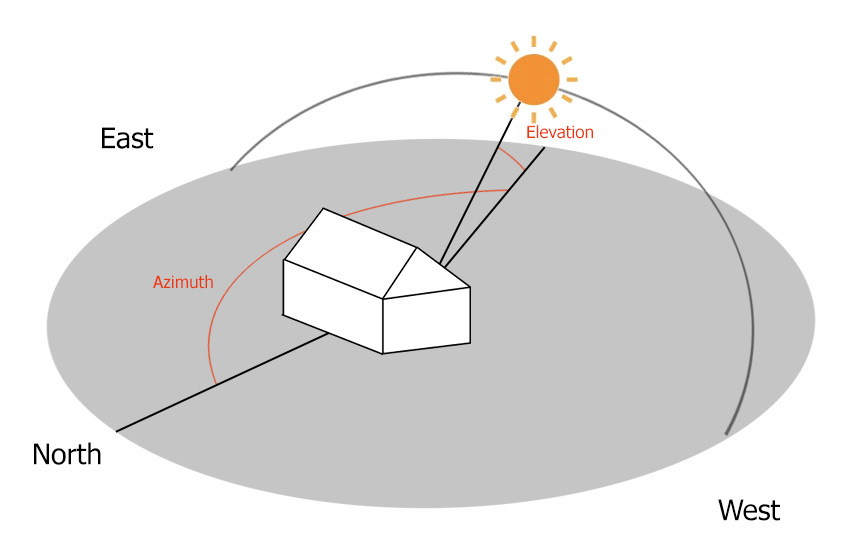

# php-sunPos

## php class for sun datas

This php class is an easy way to get sun data, giving latitude and longitude, and/or date/time:
- Sun elevation
- Sun azimuth
- Sunrise time
- Sun transit time
- Sunset time


Jeedom user ? Check this [example](https://github.com/KiboOst/php-sunPos/tree/master/Jeedom) of integration into Jeedom!

It also give you some data on the period of the day:

- isDay, isMorning, isNoon, isAfternoon, isEvening</br>
There periods are defined regarding sunrise, transit and sunset, with an adjustement factor based on day lenght to be more relevant regarding summer/winter.

- It can also return if a sector is directly lighted by sun.</br>
So, for home automation, you can know if sun hit your facade/windows.

<p align="center"></p>

I personnally developed this class for smarthome automation, which allow me to know several times a day if the sun hit which windows in my home.</br>
So, also having internal/external temperatures from some Netatmo modules, I can define if shutters should close to keep the home fresh in summer, or hot in winter. All set regarding if we are at home or not.</br>
You can developed tons of different scripts with your own sensors, scenarii and preferences!

Sun data depends on your location, and changes everyday regarding date/time. So, here is SunPos!

Feel free to submit an issue or pull request to add more.

## Requirements
- PHP server (being on a NAS or online)


## How-to
- Download class/phpDevoloAPI.php and put it on your server.
- Include phpSunPos.php in your script.


```php
require($_SERVER['DOCUMENT_ROOT'].'/path/to/phpSunPos.php');

//All depends on your location on earth:
$lat = 37.264910;
$long = -115.797592;
//You can force a Timezone if your server isn't located at same place:
$timezone = 'America/Los_Angeles';

//Initialize class with your home latitude and longitude:
$_SunPos = new sunPos($lat, $long, $timezone);

//All datas should be there!
echo "<pre>_____>_SunPos:<br>".json_encode($_SunPos, JSON_PRETTY_PRINT)."</pre><br>";

/*
_____>_SunPos:
{
    "_version": "1.0",
    "latitude": 37.26491,
    "longitude": -115.797592,
    "date": {
        "date": "1947-07-08 15:51:00.000000",
        "timezone_type": 3,
        "timezone": "America\/Los_Angeles"
    },
    "timezone": "America\/Los_Angeles",
    "elevation": "36.24",
    "azimuth": "272.20",
    "sunrise": "04:30:10",
    "transit": "11:48:11",
    "sunset": "19:06:12",
    "isDay": 1,
    "isMorning": 0,
    "isNoon": 0,
    "isAfternoon": 1,
    "isEvening": 0
}
*/

echo 'elevation: ', $_SunPos->elevation, "<br>";
echo 'azimuth: ', $_SunPos->azimuth, "<br>";
echo 'isMorning: ', $_SunPos->isMorning, "<br>";

//Let's say you have a home facade towards south:
$isSunny = $_SunPos->isSunny(90, 180);
echo 'isSunny: ', $isSunny ? 'true' : 'false', "<br>";

//same facade pointing towars north:
$isSunny = $_SunPos->isSunny(180, 90);
echo 'isSunny: ', $isSunny ? 'true' : 'false', "<br>";

//If you want to know sun position/orientation at a particular date/time:
$date = '1947-07-8';
$time = '15:51';
$_SunPos = new sunPos($lat, $long, $timezone, $date, $time);

//You can ask for day state like this:
$state = $_SunPos->getDayState();

```

By default, state of day is returned in english. You can pass sixth argument for language.
Supported languages: 'en', 'fr', 'es'.

```php
$_SunPos = new sunPos($lat, $long, $timezone, false, false, 'fr');
$state = $_SunPos->getDayState();
```


## Version history

#### v 1.3 (2024-09-27)
- isSunny() now allow passing sunpos


#### v 1.2 (2019-12-07)
- New: getDayState()
- New: call with last parameter lang. Supported: en, fr, es.

#### v 1.1 (2018-05-23)
- Better noon, afternoon and evening calculation.

#### v 1.0 (2017-11-23)
- First public version!

## License

The MIT License (MIT)

Copyright (c) 2017 KiboOst

Permission is hereby granted, free of charge, to any person obtaining a copy
of this software and associated documentation files (the "Software"), to deal
in the Software without restriction, including without limitation the rights
to use, copy, modify, merge, publish, distribute, sublicense, and/or sell
copies of the Software, and to permit persons to whom the Software is
furnished to do so, subject to the following conditions:

The above copyright notice and this permission notice shall be included in all
copies or substantial portions of the Software.

THE SOFTWARE IS PROVIDED "AS IS", WITHOUT WARRANTY OF ANY KIND, EXPRESS OR
IMPLIED, INCLUDING BUT NOT LIMITED TO THE WARRANTIES OF MERCHANTABILITY,
FITNESS FOR A PARTICULAR PURPOSE AND NONINFRINGEMENT. IN NO EVENT SHALL THE
AUTHORS OR COPYRIGHT HOLDERS BE LIABLE FOR ANY CLAIM, DAMAGES OR OTHER
LIABILITY, WHETHER IN AN ACTION OF CONTRACT, TORT OR OTHERWISE, ARISING FROM,
OUT OF OR IN CONNECTION WITH THE SOFTWARE OR THE USE OR OTHER DEALINGS IN THE
SOFTWARE.
